# TikTok Geo-Regulation AI System - Team Handover

**Phase 1 Complete ✅ | Ready for Integration 🚀**

Multi-agent AI system for TikTok compliance analysis across global jurisdictions.

---

## 🚀 Quick Start

```bash
# 1. Setup environment
git clone <repository> && cd techjam-jamming
cp .env.template .env

# 2. Add API key to .env (any one works)
# GOOGLE_API_KEY=your_key  # FREE tier available
# ANTHROPIC_API_KEY=your_key
# OPENAI_API_KEY=your_key

# 3. Start system
docker-compose up -d

# 4. Access
# - UI: http://localhost:8501
# - API: http://localhost:8000
# - Docs: http://localhost:8000/docs
```

---

## 👥 Team Assignments

### 🔍 **MCP Team** (Lucas & JH)
**Deliverable**: 5 Legal Search Services

#### Your Files
```
src/mcp/                       # YOUR DOMAIN
├── utah-search-mcp/           # Utah Social Media Act
├── eu-search-mcp/             # EU DSA + GDPR  
├── california-search-mcp/     # COPPA/CCPA
├── florida-search-mcp/        # Minor Protection Act
├── brazil-search-mcp/         # LGPD + Data Localization
└── shared-chroma/             # ChromaDB setup

docker-compose.yml             # Add MCP services (lines 68-94)
```

#### Required API
```bash
POST /api/v1/search           # Semantic search endpoint
GET /health                   # Health check

# Ports: 8010-8014 (Utah, EU, CA, FL, Brazil)
# Full specs: docs/MCP.md
```

---

### ⚡ **Team Member 1** - MCP Integration
**What & Why**: Replace mock MCP services with real HTTP clients.

**Deliverable**: Real MCP client + system monitoring

#### Your Files (Placeholder Files Created ✅)
```
src/services/mcp_client.py              # TODO: Replace mock MCPs with HTTP calls
src/services/metrics.py                 # TODO: Implement performance metrics collection  
src/services/performance_monitor.py     # TODO: Add real-time monitoring & alerts

# MODIFY EXISTING FILES (update imports/integrations):
src/core/agents/lawyer_agent.py         # Update Line 24: Use real MCP client
src/core/workflow.py                    # Update Line 26: Inject real MCP client  
src/main.py                             # Add health/metrics endpoints
```

#### Tasks
- Replace `src/core/agents/mock_mcps.py` with real HTTP calls
- Add performance monitoring and metrics collection
- Enable flag: `ENABLE_REAL_MCPS=true`

#### Search for: `# TODO: Team Member 1`

---

### ⚡ **Team Member 2** - UI, Batch Processing & Document Processing
**What & Why**: Transform basic UI into a production-ready platform. Currently users can only analyze one feature at a time.

**Business Impact**:
- **Productivity**: Batch processing lets users analyze 50+ features from CSV instead of one-by-one
- **Document Processing**: Users can upload PDF specifications and extract features automatically
- **Insights**: Workflow visualization shows users exactly how their features get analyzed
- **User Experience**: Interactive dashboards make the system feel professional vs prototype

**Deliverable**: Enhanced UI + CSV batch processing + PDF document processing

#### Your Files (Placeholder Files Created ✅)
```
src/ui/components/batch_processor.py        # TODO: CSV upload & batch processing UI
src/ui/components/document_processor.py     # TODO: PDF upload & feature extraction UI  
src/ui/components/enhanced_results.py       # TODO: Interactive charts & visualizations
src/ui/components/metrics_dashboard.py      # TODO: Real-time performance dashboard
src/ui/components/workflow_viz.py           # ✅ Already exists - enhance as needed

src/api/endpoints/batch.py                  # TODO: Batch processing API endpoints
src/api/endpoints/documents.py              # TODO: PDF processing API endpoints

# MODIFY EXISTING FILES (integrate new components):
src/ui/app.py                               # Import & integrate new UI components
src/main.py                                 # Add new API endpoint routers
src/core/workflow.py                        # Already updated for unified workflow ✅
```

#### Tasks
- CSV batch upload with background processing
- PDF document upload and feature extraction
- Real-time workflow visualization 
- Interactive performance dashboard
- Enhanced UI with charts and progress tracking
- Enable flags: `ENABLE_BATCH_PROCESSING=true`, `ENABLE_WORKFLOW_VIZ=true`, `ENABLE_PDF_PROCESSING=true`

#### Search for: `# TODO: Team Member 2`

---

## 🏗️ Target Architecture (Unified Workflow)

```mermaid
graph TB
    subgraph "Enhanced Frontend Layer"
        UI[Enhanced Streamlit UI<br/>✅ Basic UI Working<br/>🔧 Team Member 2: Dashboards + Charts]
        API[FastAPI REST API<br/>✅ Core API Working<br/>🔧 Team Member 2: + Batch Endpoints]
    end
    
    subgraph "Core Services"
        WF[LangGraph Workflow<br/>✅ Current Implementation<br/>🔧 Needs: Unified Pipeline Fix]
        RT[Input Router<br/>✅ Type Detection Working<br/>🔧 Needs: Route Everything to JSON Refactorer]
    end
    
    subgraph "Unified Processing Pipeline"
        JR[JSON Refactorer<br/>✅ Working for Features<br/>🔧 Needs: Handle ALL input types]
        BP[Batch Processor<br/>❌ Not Implemented<br/>🔧 Team Member 2: CSV → Multiple Features]
        DP[Document Processor<br/>❌ Not Implemented<br/>🔧 Team Member 2: PDF → Features]
        LA[Lawyer Agent<br/>✅ Working with Mock MCPs<br/>🔧 Team Member 1: Real MCP Integration]
    end
    
    subgraph "Real MCP Services Layer"
        MC[HTTP MCP Client<br/>❌ Not Implemented<br/>🔧 Team Member 1: Replace Mock MCPs]
        UT[Utah Search MCP<br/>❌ Not Implemented<br/>🔧 MCP Team: Port 8010]
        EU[EU Search MCP<br/>❌ Not Implemented<br/>🔧 MCP Team: Port 8011] 
        CA[California Search MCP<br/>❌ Not Implemented<br/>🔧 MCP Team: Port 8012]
        FL[Florida Search MCP<br/>❌ Not Implemented<br/>🔧 MCP Team: Port 8013]
        BR[Brazil Search MCP<br/>❌ Not Implemented<br/>🔧 MCP Team: Port 8014]
    end
    
    subgraph "Data Layer"
        PG[(PostgreSQL<br/>✅ Working)]
        CH[(ChromaDB<br/>❌ Not Implemented<br/>🔧 MCP Team: Legal Document Storage)]
    end
    
    subgraph "LLM Layer"
        LLM[LLM Service<br/>✅ Basic Service Working<br/>🔧 Team Member 1: Enhanced Fallback Chain]
        GM[Google Gemini<br/>✅ Working - Primary]
        CL[Claude<br/>✅ Available - Fallback]
        GP[GPT<br/>✅ Available - Fallback]
    end
    
    subgraph "Monitoring Layer"
        MT[Metrics Collector<br/>❌ Not Implemented<br/>🔧 Team Member 1]
        PM[Performance Monitor<br/>❌ Not Implemented<br/>🔧 Team Member 1]
        WV[Workflow Visualizer<br/>❌ Not Implemented<br/>🔧 Team Member 2]
    end
    
    %% Main Flow: ALL inputs go through unified pipeline
    UI --> API
    API --> WF
    WF --> RT
    
    %% Input routing (type detection only)
    RT -->|Single Feature| JR
    RT -->|User Query| JR
    RT -->|CSV Batch| BP
    RT -->|PDF Document| DP
    
    %% Preprocessing → JSON Refactorer
    BP -->|Extracted Features| JR
    DP -->|Extracted Features| JR
    
    %% Unified pipeline: JSON Refactorer → Lawyer Agent
    JR --> LA
    
    %% Lawyer Agent calls MCPs as needed
    LA --> MC
    MC --> UT
    MC --> EU
    MC --> CA
    MC --> FL
    MC --> BR
    
    %% MCPs search ChromaDB
    UT --> CH
    EU --> CH
    CA --> CH
    FL --> CH
    BR --> CH
    
    %% MCPs return search results to Lawyer Agent
    UT --> LA
    EU --> LA
    CA --> LA
    FL --> LA
    BR --> LA
    
    %% Lawyer Agent uses LLM for synthesis
    LA --> LLM
    
    LLM --> GM
    LLM --> CL
    LLM --> GP
    
    %% Monitoring integration
    WF --> MT
    MT --> PM
    PM --> WV
    WV --> UI
    
    %% Database connections
    LA --> PG
    WF --> PG
    MT --> PG
    
    style JR fill:#e8f5e8
    style LA fill:#e8f5e8
    style MC fill:#fff3e0
    style CH fill:#fff3e0
    style MT fill:#fff3e0
    style PM fill:#fff3e0
    style WV fill:#e0f2f1
    style BP fill:#e0f2f1
    style DP fill:#e0f2f1
    style RT fill:#f3e5f5
```



---

## ✅ Current Features (Working)

- **Universal API**: Single `/api/v1/process` endpoint handles any input
- **Smart Routing**: Auto-detects features vs queries vs PDFs  
- **Dual-Mode Analysis**: Compliance analysis + advisory responses
- **LLM Integration**: Google Gemini with model switching
- **5 Jurisdictions**: Utah, EU, California, Florida, Brazil
- **Docker Deploy**: Single-command setup
- **Modern Stack**: FastAPI + Streamlit + PostgreSQL

---

## 🧪 Testing

```bash
# Feature Analysis
curl -X POST http://localhost:8000/api/v1/process \
  -H "Content-Type: application/json" \
  -d '{"name": "Live Shopping", "description": "Real-time shopping with payment processing"}'

# User Query  
curl -X POST http://localhost:8000/api/v1/process \
  -H "Content-Type: application/json" \
  -d '{"query": "What are Utah age verification requirements?"}'

# Health Check
curl http://localhost:8000/api/v1/health
```

---

## 🚨 Integration Rules

### DO NOT TOUCH
```
src/core/agents/         # AI agent logic (complete)
src/core/models.py       # Data models (complete)  
src/core/llm_service.py  # LLM service (complete)
data/                    # Static data (complete)
docs/                    # Documentation (complete)
```

### SHARED FILES (Coordinate!)
```
docker-compose.yml       # MCP Team + Team Member 1
src/main.py             # Team Member 1 + Team Member 2 (different lines)
.env                    # All teams (different flags)
```

### Communication Protocol
1. **Check line ranges** before modifying shared files
2. **Create your directories** - don't modify others  
3. **Report conflicts** immediately if they occur
4. **Test integration** after each major change

---

## 📋 Success Criteria

### MCP Team
- [ ] 5 MCP services responding on ports 8010-8014
- [ ] ChromaDB integration working
- [ ] Search API returns legal document chunks
- [ ] Health checks passing

### Team Member 1  
- [ ] Mock MCP calls replaced with real HTTP
- [ ] Performance metrics collection working
- [ ] All original features still functional

### Team Member 2
- [ ] CSV batch upload working (50+ features)
- [ ] PDF document upload and feature extraction
- [ ] Real-time workflow visualization
- [ ] Interactive performance dashboard  
- [ ] Enhanced UI with charts and progress
- [ ] All original features preserved

### Competition Ready
- [ ] >90% accuracy on test dataset
- [ ] Sub-3-second response times
- [ ] Demo polished and rehearsed
- [ ] All acceptance criteria met

---

## 🔍 Troubleshooting

**API Key Issues**: Add any one key to `.env` - system works with Google (free), Anthropic, or OpenAI

**Database Issues**: `docker-compose restart postgres`  

**Import Errors**: Run from project root with `uv run python -m src.main`

**Container Issues**: Force rebuild with `docker-compose build --no-cache`

**Detailed Logs**: `docker-compose logs -f app`

---
