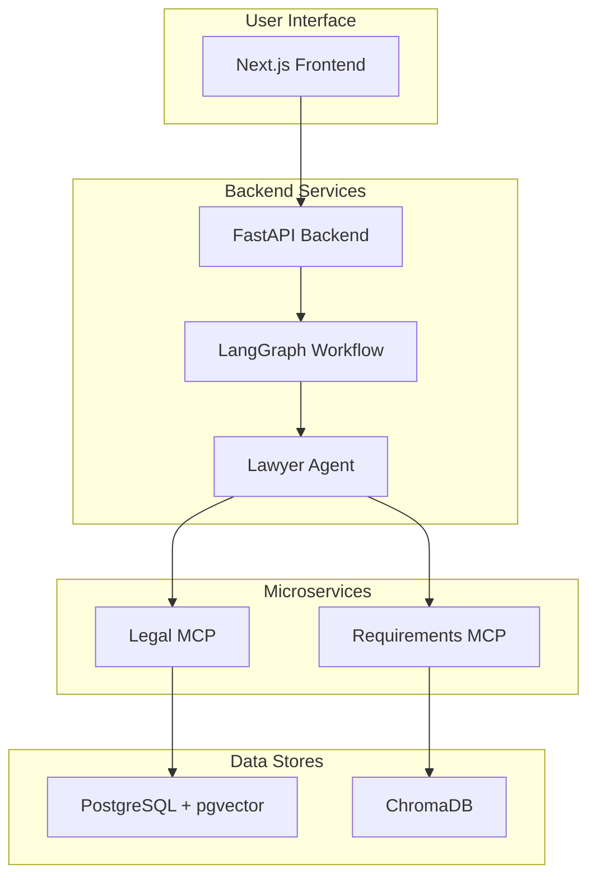

# TikTok Geo-Regulation AI System

**Production Ready ✅ | Real Legal MCP Integrated 🎉 | Multi-Agent Architecture**

AI-powered legal compliance analysis system for TikTok features across global jurisdictions using PostgreSQL + pgvector semantic search.

## 🚀 Overview

This project is a sophisticated, AI-powered system designed to automate the legal compliance analysis of TikTok features across multiple global jurisdictions. It leverages a multi-agent architecture, semantic search, and a modern web interface to provide a comprehensive solution for legal and product teams.

The system is composed of a FastAPI backend, a Next.js frontend, and several microservices, all containerized with Docker for easy deployment and scalability.

## ✨ Features

- **Automated Compliance Analysis:** Automatically analyzes TikTok features for compliance with regulations in various jurisdictions.
- **Semantic Search:** Utilizes PostgreSQL with the `pgvector` extension and ChromaDB for powerful semantic search capabilities.
- **Multi-Agent Architecture:** Employs a multi-agent system, likely built with LangGraph, to handle complex analysis workflows.
- **Document Management:** Allows users to upload, manage, and search legal and requirements documents.
- **Real-time Updates:** The frontend provides real-time updates on the status of analysis workflows using Server-Sent Events (SSE).
- **Human-in-the-Loop (HITL):** Includes a HITL feature for manual review and intervention in the analysis process.
- **Modern Web Interface:** A professional and user-friendly frontend built with Next.js and shadcn/ui.
- **Containerized Deployment:** The entire system is containerized with Docker, allowing for easy setup and deployment.

## 🛠️ Tech Stack

**Backend:**
- Python
- FastAPI
- LangChain & LangGraph
- PostgreSQL with pgvector
- ChromaDB
- SQLAlchemy

**Frontend:**
- Next.js
- React
- TypeScript
- shadcn/ui
- Tailwind CSS

**Infrastructure:**
- Docker
- Docker Compose

## Architecture

The system follows a microservices-based architecture, with the following key components:

- **Frontend:** A Next.js application that provides a modern and professional user interface for interacting with the system.
- **Backend (FastAPI):** The core of the application, responsible for handling API requests, orchestrating workflows, and managing data.
- **Legal MCP (Mission Control Post):** A microservice that provides semantic search capabilities for legal documents. It uses a sentence transformer model to generate embeddings for legal documents and stores them in a PostgreSQL database with the `pgvector` extension.
- **Requirements MCP:** A microservice that manages and searches requirements documents. It uses ChromaDB for semantic search and PostgreSQL to store document metadata.
- **Databases:** The system uses two primary databases: a PostgreSQL database with the `pgvector` extension for the Legal MCP, and a ChromaDB database for the Requirements MCP.

### Detailed Architecture Diagram



### Data Flow

1.  A user interacts with the **Frontend** to submit a feature for analysis or to search for legal information.
2.  The **Frontend** sends a request to the **Backend (FastAPI)**.
3.  The **Backend** receives the request and initiates a **LangGraph Workflow**.
4.  The **Workflow** routes the request to the appropriate agent, in this case, the **Lawyer Agent**.
5.  The **Lawyer Agent** interacts with the **Legal MCP** and **Requirements MCP** to gather relevant information.
6.  The **Legal MCP** performs a semantic search on the legal documents stored in the **PostgreSQL** database.
7.  The **Requirements MCP** performs a semantic search on the requirements documents stored in the **ChromaDB** database.
8.  The **Lawyer Agent** receives the search results, analyzes them, and generates a response.
9.  The response is sent back through the workflow and the **Backend** to the **Frontend**, which displays the results to the user.

## 🚀 Getting Started

### Prerequisites

- Docker
- Docker Compose
- Git

### Installation

1.  **Clone the repository:**
    ```bash
    git clone <repository-url>
    cd techjam-jamming
    ```

2.  **Set up environment variables:**
    ```bash
    cp .env.template .env
    ```
    Edit the `.env` file and add your API keys (e.g., `GOOGLE_API_KEY`).

3.  **Build and run the application:**
    ```bash
    docker-compose up -d --build
    ```

4.  **Access the applications:**
    - **Frontend:** [http://localhost:3000](http://localhost:3000)
    - **Backend API:** [http://localhost:8000](http://localhost:8000)
    - **API Docs:** [http://localhost:8000/docs](http://localhost:8000/docs)
    - **Legal MCP:** [http://localhost:8010](http://localhost:8010)
    - **Requirements MCP:** [http://localhost:8011](http://localhost:8011)

## 📂 Project Structure

```
.
├── data/                 # Data files
├── docs/                 # Documentation
├── frontend/             # Next.js frontend
├── scripts/              # Database initialization scripts
├── src/                  # Backend source code
│   ├── api/              # FastAPI endpoints
│   ├── core/             # Core application logic
│   ├── database/         # Database models
│   ├── legal-mcp/        # Legal MCP service
│   └── requirements-mcp/ # Requirements MCP service
├── .env.template         # Environment variable template
├── docker-compose.yml    # Docker Compose configuration
├── Dockerfile            # Dockerfile for the backend
└── README.md             # This file
```

## 📄 API Endpoints

The main API endpoints are documented using Swagger UI, which can be accessed at [http://localhost:8000/docs](http://localhost:8000/docs).

Key endpoints include:

- `POST /api/v1/process`: The main endpoint for initiating a compliance analysis.
- `POST /api/documents/upload`: For uploading documents.
- `GET /api/documents`: To retrieve a list of documents.
- `POST /api/workflow/start`: To start a new analysis workflow.

## 🤝 Contributing

Contributions are welcome! Please feel free to submit a pull request.

## 📝 License

This project is licensed under the MIT License. See the `LICENSE` file for details.